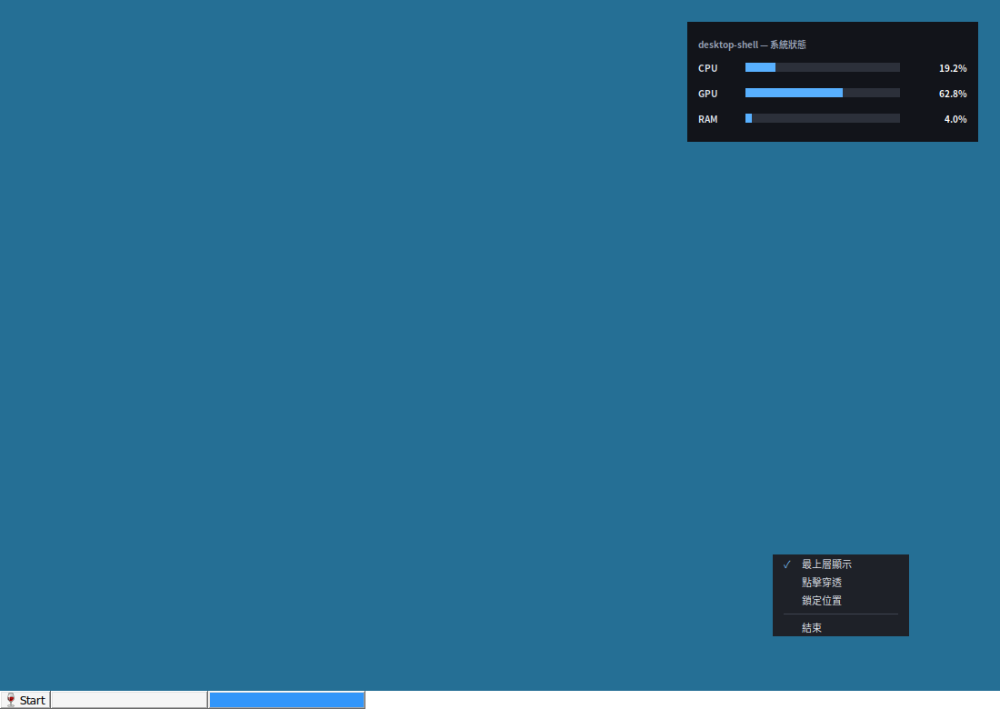
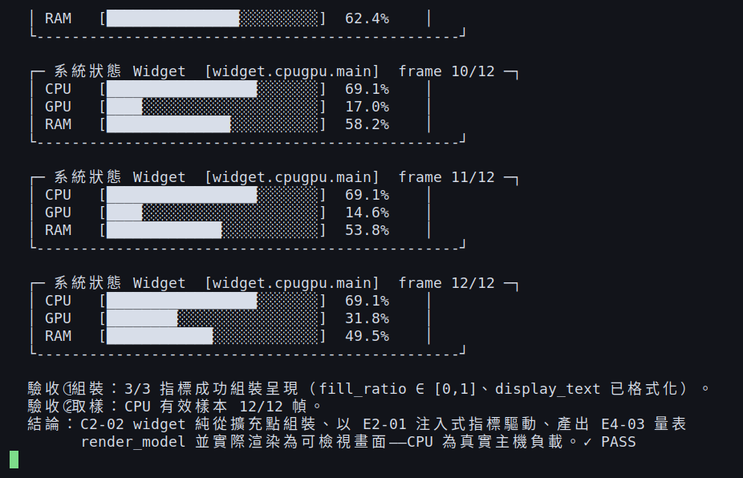
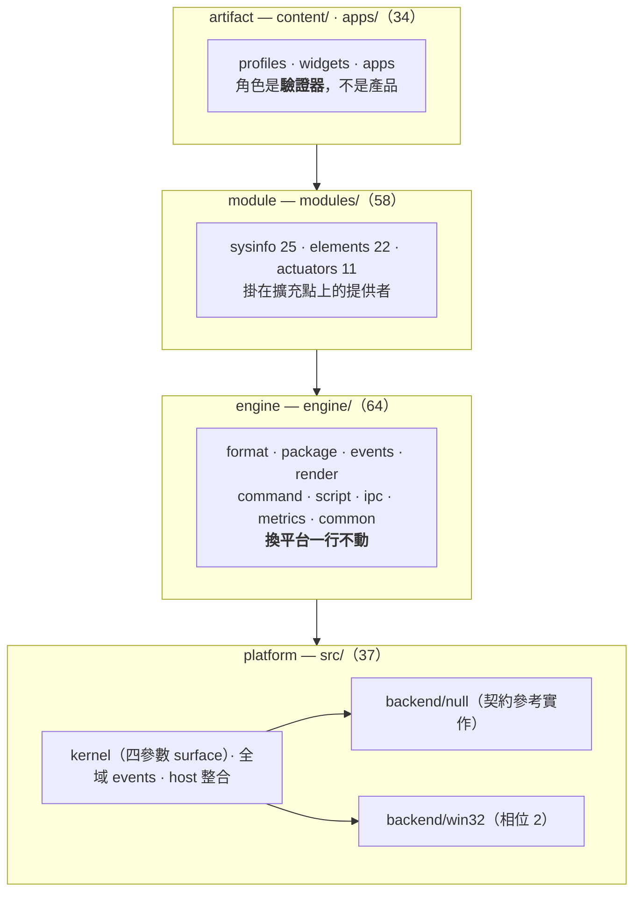
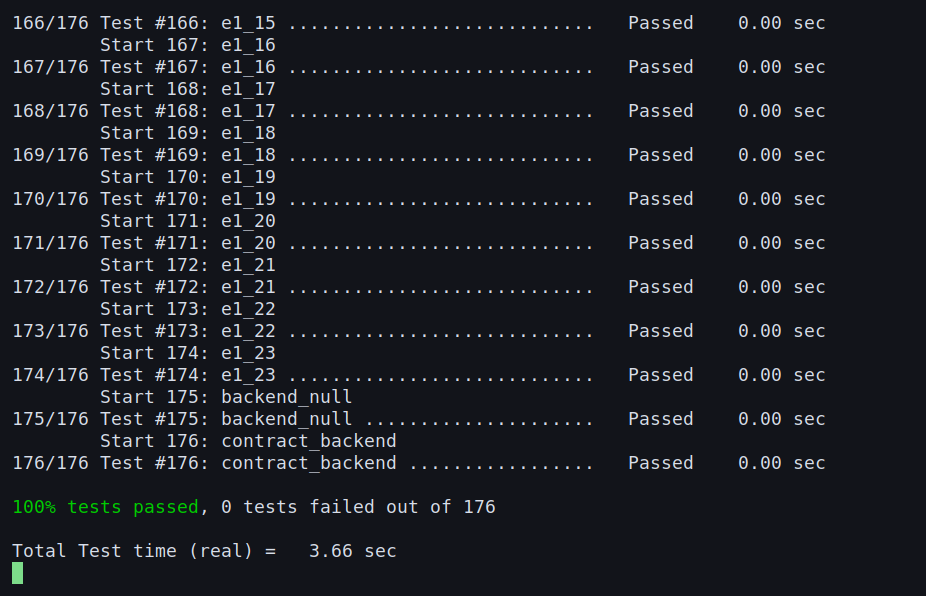

<h1 align="center">desktop-shell</h1>

<p align="center">
  <b>單一 surface kernel 上的桌面 shell 引擎</b><br>
  監控面板、桌面角色、召喚式啟動器、短暫浮層 —— 共用同一組圖層／輸入策略／命中測試原語。<br>
  Windows 優先，跨平台降級路徑由能力矩陣閘控。
</p>

<p align="center">
  <a href="LICENSE"></a>
  
  
  <a href=".github/workflows/governance.yml"></a>
  
</p>

---

## 這是什麼

**本 repo 的產品是平台，不是桌面工具。**

一個平台由它的**擴充點**定義，不由它的功能定義。所以驗收條件不是「能不能顯示一個 CPU 掛件」，
而是：**能不能在不修改平台任何一行的前提下，讓外部加上一個 CPU 掛件。**

起點是四個各有十年開發史的產品 —— Rainmeter（系統監控）、end-4 illogical-impulse（Linux 桌面 shell）、
SAO Utils（ACG 風格啟動器）、伺か Ukagaka（桌面角色）。攤平列出得到 220 個候選功能；
按**功能類型**重新分類後，它們塌縮到 15 個原語，其中五個就撐起約七成的項目。

四個產品的差異，其實只是同一組視窗原語的四種參數取值：

| 呈現形態 | 圖層 | 輸入策略 | 命中策略 | 生命週期 |
|---|---|---|---|---|
| 監控面板 | 桌面層 | 穿透 | 部分區域 | 常駐 |
| 桌面角色 | 桌面層偏上 | 可互動 | **具名區域** | 常駐 |
| 召喚面板 | 最上層 | **獨占焦點** | 全域 | 召喚式 |
| 短暫浮層 | 最上層 | 不可互動 | 無 | 短暫 |

第三欄的矛盾是全案技術風險最高的地方：監控面板必須**永遠不取得焦點**，召喚面板必須**強制搶到前景**，
而兩者要在**同一個行程內共存**。這是唯一真正困難的部分，其餘多半是工作量而非難度。

看清這點之後，那四個產品就不再是四個目標，而是**四個驗證核心的範例**。

## 實際畫面

### 桌面 runtime（Windows host）

`host/app` 把 widget 算出的 `RenderModel` 畫成桌面上的真實視窗：最上層、不搶焦點、
可拖曳、會吸邊、會記位置。CPU 與 RAM 是主機真實負載，GPU 為 sweep 模擬。

<p align="center">
  
</p>

托盤右鍵是 **W1-05 自繪選單**（W1-06 另附 MSAA 無障礙支援）。
「最上層顯示」前面的勾號就是 H1-04 持久化下來的 UI 開關狀態 ——
**一個每次啟動都自己解鎖的「鎖定」等於沒有鎖**：

<p align="center">
  
</p>

> **取像環境**：上面兩張是把 `desktop_shell_host.exe` 以 **mingw-w64 交叉編譯**後、
> 在 **Wine 的虛擬桌面**上執行所截。**程式碼一行未改**，但這不是原生 Windows 的畫面 ——
> 字型替換（Wine 對 `Segoe UI` 的代用字型）與視窗合成細節會與實機有出入。
> 專案本身以 **MSVC** 建置，由 CI 的 `gate_windows` 每個 PR 實跑；
> mingw 這條路徑只為了取像，不是支援的建置方式。
> 實機的目視驗收紀錄（自繪選單外觀、hover／點選、邊緣翻轉、托盤圖示比對）
> 見 [`docs/backlog/HANDOFF.md`](docs/backlog/HANDOFF.md) §0-B。

### 主控台驗證器（跨平台，null 後端）

`examples/cpu_gpu_validator` 是階段 A 的驗證器：**不改 `src/` 任何一行**，
純從已合併的擴充點組裝出同一個 CPU/GPU/RAM widget，把同一份 `RenderModel`
（`fill_ratio` + `display_text`）畫成主控台畫面。

**兩者的組裝路徑完全相同，換掉的只有最外層的呈現** —— 這正是「平台」與「工具」的差別。

<p align="center">
  
</p>

驗收②之所以單獨存在，是因為驗收①只看 `fill_ratio` 是否落在 `[0,1]` —— 而 `0.0` 完美滿足它。
一旦 CPU 取樣壞掉、量表整輪停在 0.0%，只查值域的驗收照樣印 `✓ PASS`。
**壞掉的指標會偽裝成「CPU 很閒」**，這是會放行假綠燈的驗收條件，比讀不到值本身更危險（知識庫 K-002）。

## 五個擴充點

平台的實質內容就是這五個契約，其餘項目都在支撐它們。

| # | 擴充點 | 契約 | 掛什麼 |
|---|---|---|---|
| 1 | **指標** | `E2-01` 統一指標介面（名稱／值／單位／範圍／歷史／列舉實例） | 感測器：CPU、GPU、網路、任意來源 |
| 2 | **元件** | `E4` 繪製基座 + 元件註冊 | 視覺元件：長條、直方圖、任意繪製型別 |
| 3 | **動作** | `E6-01` 命令匯流排 | 致動器：音量、電源、任意副作用 |
| 4 | **Profile** | `E1` 四參數（圖層／輸入策略／命中策略／生命週期） | surface 型態：skin、立繪、浮層、面板 |
| 5 | **腳本** | `E8-01` 腳本引擎 + `E8-04` 模組載入 | 行為：對話、自訂邏輯 |

**指標介面之所以是第一個，是因為它決定了「不限於」能不能成立。**
若掛件直接相依個別感測器，每加一個指標就要改掛件 —— 那不是「包含但不限於 CPU/GPU/RAM…」，
是「限於當初寫進去的那幾個」。

## 架構分層

分層不是文件上的分類，而是**目錄結構就看得出來的事**：換平台時要改哪裡，一眼可見。



| layer | 位置 | 內容 | 換平台時 |
|---|---|---|---|
| **platform** | `src/**` | 對系統的操作：surface kernel、全域事件、宿主整合、平台後端 | **只有這裡要改** |
| **engine** | `engine/**` | 宣告式格式、封裝、非全域事件、繪製基座、命令匯流排、腳本、IPC、指標契約 | 一行不動 |
| **module** | `modules/**` | `sysinfo`（指標提供者）／`elements`（元件型別）／`actuators`（致動器） | 一行不動 |
| **artifact** | `content/**`、`apps/**` | 桌面上顯示的產出物 —— 每塊核心能力的驗收條件 | 一行不動 |

**「感測器不得出現在 `src/`」因此是機械可查的**：若某個指標提供者出現在 `src/`，
那就是擴充點沒做好的訊號。

### 硬性約束（由機器擋，不靠自制力）

| 約束 | 為什麼 | 誰擋 |
|---|---|---|
| 核心 API 不得出現絕對座標與數字 z-order | Wayland 沒有全域座標系，`setPosition(x, y)` 在那裡**無法表達**；定位一律走 `anchor(edge, offset)` | 建置期 lint（`E1-22`） |
| 能力閘控 API 必須有 `has()` 保護 | 同上，否則跨平台是重寫不是移植 | 同上 |
| 契約測試不得包含平台分支 | 一旦分平台，它就不是契約，是兩套各自為政的測試 | `backend_guard.py` |
| 組件載入不得需要修改核心 | 否則擴充點是假的 | 驗證器斷言 `src/` 的 git diff 為空 |
| 較早階段不得依賴較晚階段 | 被依賴者應提前，而非讓依賴者延後 | `stage_check.py` |
| 每個 PR 的變更落在該工作單元宣告的範圍內 | 讓「不得擴權」從紀律變成機器強制 | `scope_check.py` |

## 目錄結構

```
src/          platform：對系統的操作（換平台只有這裡要改）
├── kernel/       surface kernel、四參數 profile、能力矩陣、DPI
│   └── backend/  null（契約參考實作）· win32（相位 2）
├── events/       全域事件：全域熱鍵、系統事件、全域指標手勢
└── host/         宿主整合：系統匣、自繪選單、開機自啟

engine/       engine：平台中立邏輯（換平台一行不動）
├── format/       宣告式格式、變數、公式引擎、熱重載、設定遷移
├── package/      套件格式、manifest、組件組合、佈局存檔
├── events/       非全域事件：滑鼠／懸停／心跳／滾輪／拖曳判定／計時器
├── render/       繪製基座：paint / transform / clip / text
├── command/      命令匯流排與分派、動作註冊表、條件動作
├── script/       腳本引擎、對話直譯器、行程內模組載入
├── ipc/          本機 IPC、低延遲通道、HTTP 端點、獨立行程宿主
├── metrics/      指標介面契約與採集基礎設施
└── common/       idle 資源門檻、多語系

modules/      module：擴充點上的提供者（sysinfo / elements / actuators）
content/      artifact：profiles（C1）· widgets（C2）· 內容（C3）
apps/         artifact：獨立應用型產出物（C4）
host/         相位 2 的 host shell —— 把擴充點組裝成真的跑起來的桌面 runtime
examples/     驗證器：cpu_gpu_validator（證明擴充點能被外部組裝）
tests/        contract/（跨後端契約）· gates/（治理閘門自身）· e1…e12 / c1…c4
scripts/      治理工具：plan / scope_check / backend_guard / stage_check / …
docs/         需求、架構、結構、變更帳本（CHG）、驗收（ACC）、知識庫、backlog
```

## 目前狀態

| 項目 | 現況 |
|---|---|
| 相位 | **2（Windows）** —— 允許後端 `null` + `win32` |
| 工作單元 | **193 個**，已完成 **187**，剩 6（`W1-07` 逐像素 alpha、`H1-06`～`H1-10` 繪製／組合／就地編輯） |
| 測試 | **187 個註冊 CTest 測試**（其中 11 個為 Windows 專屬）+ 7 支 Python 閘門測試 |
| CI | 每個 PR 跑 **ubuntu + Windows 雙閘門**、共 **11 道** |
| 已達成 | 桌面上有一個可拖曳、會吸邊、會記位置、有托盤選單與 MSAA 無障礙支援的真實 widget |

相位 2 的本質不是「加功能」，是把 **63 個 `backend_followup: true` 的真實後端**填進去。

進度隨時可複算：

```bash
python3 scripts/plan.py status      # 進度總覽（依 wave）
python3 scripts/plan.py next        # 下一批可並行派工的單元
```

## 建置與執行

需求：**C++17 編譯器**、**CMake ≥ 3.16**、Python 3.12（治理腳本）。
GoogleTest 1.15.2 由根 `CMakeLists.txt` 以 `FetchContent` 取得（首次建置需網路）。

### Windows（完整功能，含 win32 後端與 host runtime）

```bash
cmake -S . -B build -A x64
cmake --build build --config Debug --parallel 4
ctest --test-dir build -C Debug --output-on-failure

# 桌面 runtime：托盤右鍵有選單（最上層／點擊穿透／鎖定位置／結束）
build/units/host/app/Debug/desktop_shell_host.exe
```

設定檔寫在 `%LOCALAPPDATA%\desktop-shell\`（`positions.conf`、`ui-state.conf`）。

> **不要在 CI 或腳本裡釘死 Visual Studio 產生器版本**（`-G "Visual Studio 17 2022"`）——
> runner 映像的 VS 版本會隨時間更新，釘死等於把建置綁在某一版映像上。省略 `-G`、只給 `-A x64`。

### macOS / Linux（null 後端，平台中立部分）

`host/` 各子目錄自帶 `if(WIN32)` 守衛，在非 Windows 上收得到檔但不產生任何目標；
`engine` / `module` / `artifact` 三層與平台無關，照常建置與測試。

```bash
cmake -S . -B build -DCMAKE_BUILD_TYPE=Debug
cmake --build build -j 2          # 不要用無限並行：破百的 gtest TU 會 OOM
ctest --test-dir build --output-on-failure

# 階段 A 驗證器（上面那張圖就是它的執行畫面）
build/units/examples/cpu_gpu_validator/cpu_gpu_validator
```

非 Windows 上會少掉 11 個 Windows 專屬測試（`W1-*` / `H1-*`），
其餘 **176 個全綠** —— 這正是相位 1 的投資回收點：同一組契約測試，換後端不用改一行。

<p align="center">
  
</p>

> 原始碼一律 **UTF-8（無 BOM）**且註解與字串含中文。MSVC 預設以系統 ANSI codepage
> （CP950／CP932）讀原始碼，中文位元組會吃掉結尾引號 —— 根 `CMakeLists.txt` 的 `/utf-8`
> 是此問題的標準解，別拿掉（見知識庫 K-001）。

## 開發治理

本專案由 **ai-sdlc-autopilot** 治理：工作單元來自機器可讀的 backlog，由 `scripts/plan.py`
自動排程派工，CI 閘門把治理紀律變成機器強制，合併與否由停點契約查表決定。

**任何 agent（或人）動手之前先讀 [`AGENTS.md`](AGENTS.md)。**
工作單元一律來自 [`docs/backlog/units.json`](docs/backlog/units.json)，**不得自行發明任務**。

```bash
python3 scripts/plan.py brief <UNIT_ID> --n <序號>   # 派工簡報（原文交給 subagent）
python3 scripts/plan.py unit-for-branch <REF>        # 由分支反查工作單元
python3 scripts/plan.py gate <UNIT_ID> --gate <G>    # 查停點契約
python3 scripts/run_python_tests.py                  # 閘門自身的測試
```

### 十一道 CI 閘門

PR 一開就自動跑，執行順序 **G0 → G8 → G1 → G1b → G1c → G2 → G7 → G3 → G4 → G5 → G6**：

| 閘門 | 擋什麼 |
|---|---|
| **G0** `run_python_tests` | `tests/` 底下任一 Python 測試沒綠；**掃到 0 個檔或 0 個測試也算紅** |
| **G8** `workflow_lint` | workflow 的 `run:` 直接內插不可信的 `${{ }}`（命令注入，K-008） |
| **G1** `scope_check` | 變更超出該單元的 `write_scope` |
| **G1b** `backend_guard` | 出現當前相位不允許的平台後端 |
| **G1c** `stage_check` | 較早階段依賴較晚階段 |
| **G2** CHG linked | PR 內文缺少 CHG 參照 |
| **G7** `status_check` | 本 PR 牽涉的 CHG 尚未收尾（Status 不是 `Accepted`／`Paused`） |
| **G3** tests | 測試沒綠；**repo 沒有任何測試也算紅** |
| **G4** structure sync | 動了 `src/`、`engine/`、`modules/` 卻沒更新 `docs/structure/` |
| **G5** ACC + identity | medium 以上缺 ACC，或驗收者與實作者同一人 |
| **G6** halt gate | 停點契約：AUTO → 自動 squash merge；HALT → 貼 `halt:awaiting-human` 等人核准 |

G0 排最先，因為 `tests/` 底下的 Python 測試守的就是 `scripts/` 底下這些閘門 ——
**先證明裁判的邏輯是對的，再讓它去判 PR**。G8 次之：它守的是 workflow 自己。

一再出現的主題是**真空綠燈防線**：沒有測試不叫綠燈，叫沒有判定。
G0 與 G3 都會在「零測試」時主動紅燈；Windows 閘門另有一步逐一點名 win32 專屬 target，
防止 `if(WIN32)` 條件納入被改壞後，靠 176 個平台中立測試印出假綠燈。

### 知識庫

`docs/knowledge/` 收錄踩過的坑，每條記「**錯誤 + 根因 + 解法**」，機密只記位置不記值。
目前 **K-001 ~ K-009**，接手前**至少先讀 K-001、K-004、K-007**。

## 路線圖

- **相位 2 收尾**：`W1-07` win32 逐像素 alpha（透明背景）→ `H1-06` 繪製層改為消費 E4 `RenderModel`
  → `H1-07` 組件組合 → `H1-08` 環形量表 → `H1-09` 就地編輯 → `H1-10` 尺寸調整
- **WS4 — skin 套件格式**：skin = E9 manifest + E7 宣告式設定檔 + 素材；
  把 `examples/cpu_gpu_validator` 改寫成第一個範本 skin
- **相位 3 — cocoa 後端**：`phase.json` 的白名單已定義好；
  契約測試只需再加一個註冊點，**契約標頭不動** —— 守住了就是換後端，沒守住就是重寫

## 明確不做

以下不是暫時不做，是**決定不做**：

- **桌面環境職責**：工作區管理、系統匣接管、通知守護、鎖定畫面
  （Windows 的 Winlogon 不可取代，自製的只是吃輸入的全螢幕視窗，Ctrl+Alt+Del 就破）
- **相容既有格式**：Rainmeter INI skin、SHIORI 協定、既有 SSTP ——
  四個參考品的功能聯集在任何一個既有格式裡都表達不出來，硬相容只會讓核心被最舊的那個格式綁架
- **開放式第三方生態的治理設施**：沙箱、崩潰隔離、線上差分更新、創意工坊
- **HTML 正則抓取**：對方改版即失效的維護黑洞（HTTP + 結構化解析保留）

## 文件地圖

| 文件 | 內容 |
|---|---|
| [`AGENTS.md`](AGENTS.md) | **AI 進場點** —— 握手程序、角色層級、不可協商事項、閘門總表 |
| [`docs/requirements.md`](docs/requirements.md) | 敘述性需求、四個定案決策、什麼會讓這個專案失敗 |
| [`docs/architecture.md`](docs/architecture.md) | 分層、五個擴充點、四階段與驗證器 |
| [`docs/ai-guideline.md`](docs/ai-guideline.md) | 可驗收條款、決策紀錄、風險分級規則 |
| [`docs/structure/`](docs/structure/) | 目錄結構（`directory.md`）與各單元結構註記 |
| [`docs/backlog/units.json`](docs/backlog/units.json) | 工作單元 —— **唯一派工依據** |
| [`docs/backlog/PHASE-PLAN.md`](docs/backlog/PHASE-PLAN.md) | 分相位策略與機械保證 |
| [`docs/backlog/BUILD.md`](docs/backlog/BUILD.md) | C++／CMake／CTest 建置慣例（每個 subagent 必讀） |
| [`docs/backlog/RUNBOOK.md`](docs/backlog/RUNBOOK.md) | autopilot 執行手冊 |
| [`docs/backlog/HANDOFF.md`](docs/backlog/HANDOFF.md) | 最新進度交接、未關閉的技術債 |
| [`docs/knowledge/`](docs/knowledge/) | 錯誤知識庫（K-001 ~ K-009） |
| [`docs/changes/`](docs/changes/) · [`docs/acceptance/`](docs/acceptance/) | 變更帳本（CHG）與驗收紀錄（ACC） |

## 授權

[MIT](LICENSE) © 2026 Chien Wei, Lin
