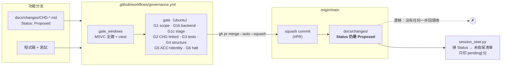
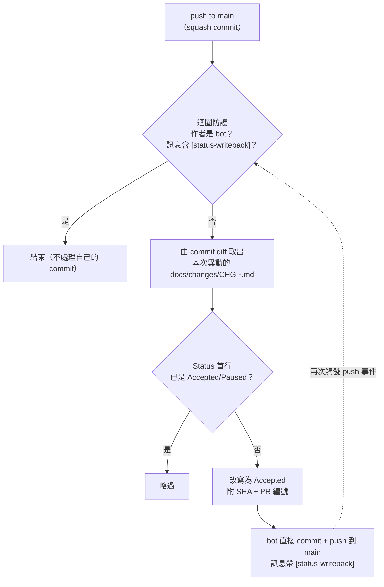
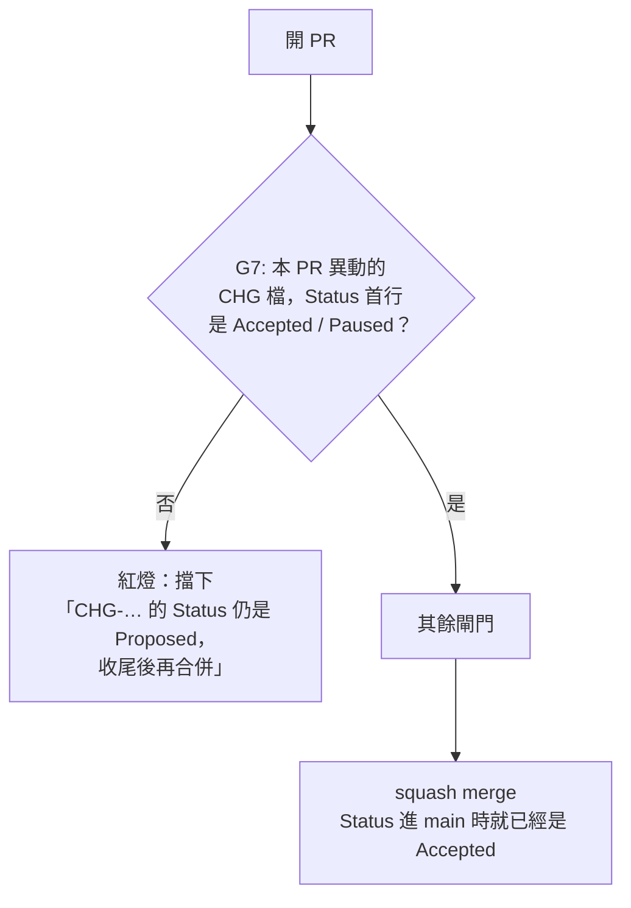

# CHG-20260810-03 — 根治 Status 漂移：合併後自動回寫 / 合併前閘門

- Date: 2026-08-10 (UTC+0) | Branch: chore/chg-20260810-03 | **Risk: medium** | Implemented by: I1（待派）
- Skill: ai-sdlc-autopilot
- Template: 標準
- Autonomy: 依政策矩陣（medium → **confirm 停點**；本檔即為停點材料）
- Unit: 無（治理機制變更，非工作單元）
- 承接：`CHG-20260810-01`（前 5 筆）、`CHG-20260810-02`（其餘 98 筆存量）

> **confirm 停點紀錄（2026-08-10）**：設計圖與 A/B 兩案已呈給使用者，
> **使用者裁決採 B 案（合併前閘門 G7）**。A 案不實作，理由見下方比較。
> 本檔其餘內容已依裁決更新為實作紀錄。

## Motivation

`-01` 與 `-02` 清掉了 103 筆存量，但兩張 CHG 都明載**根因未除**。

漂移的機制：合併發生在 PR 端，而 CHG 文件在合併之前就已凍結在功能分支上。
整條流程——subagent 寫 CHG → I1 稽核 → push → 開 PR → 八道閘門 → squash merge——
**沒有任何一步會回頭改 Status**。有 `Accepted` 的那 126 筆是當年人工補的；
靠人記得，就漏掉了 98 筆。下一批單元合併後會照樣長出來。

代價不是難看。Status 是進場握手判斷「有沒有半途而廢的階段」的唯一依據，
而 hook 只印 `pending[:5]`。兩者相乘的結果是**這道警告永遠不會歸零**，
於是它會被當成背景雜訊略過——下一次真的有未收尾時，沒有人會停下來看。
`-02` 讓它第一次歸零；本 CHG 要讓它**維持**歸零。

## 現況（受影響區域）



關鍵事實：**閘門只讀 CHG，不寫 CHG**。合併是 CI 用 `gh pr merge --auto --squash` 觸發的，
那一刻 CHG 的內容早已定稿在分支上。

## 兩個方案（confirm 停點請擇一）

### A 案 — 合併後自動回寫（使用者原始指定）



**做得到**：已查證 `main` 的分支保護為
`required_status_checks:["gate"]`、`enforce_admins:false`、**無 required PR reviews**，
且 workflow 已有 `permissions: contents: write`。bot 直推 main 技術上可行。

**四個代價**：

1. **bot 的 commit 不經任何閘門進 main**。目前 main 上每一個 commit 都是通過八道閘門的
   squash merge；開這個口之後不再是。
2. **迴圈風險**。防護寫錯 = 無限自我觸發。這是新增的失效模式，且失效時很吵。
3. **競態**。兩個 PR 幾乎同時合併時，第二個 writeback 的 push 會被拒（非 fast-forward），
   需要 rebase 重試邏輯。
4. **最重要的一點：對 infra 分支，這個 `Accepted` 是沒有根據的。**
   `is_unit=false` 的分支**不跑 G5**（ACC 存在 + `Result: pass` + 驗收者≠實作者）。
   對那些 PR，「合併了」只代表 G1b/G1c/G2/G3/G4 過了，不代表驗收過。
   機器在那裡蓋 `Accepted`，就是本 repo 已經防了兩次的**真空綠燈**：
   一個恆為真的判定，與沒有判定是同一件事。

   > 公平地說反面：對 `is_unit=true` 的單元分支，合併時 G5/G6 都已通過，
   > 「合併了」機械上就等於「驗收過了」。在那個範圍內，回寫是**記錄事實**而非**下判斷**。
   > 問題只出在 infra 分支這個缺口上。

### B 案 — 合併前閘門 G7（建議）



把問題**倒過來**：不是事後修紀錄，而是**拒絕合併沒收尾的紀錄**。

- 不需要寫入權限、不需要 bot commit、沒有迴圈、沒有競態、main 的 commit 來源不變。
- fail-closed，與 G1~G6 同一種形狀（讀 → 判定 → 紅燈），維護者不必學新東西。
- 判定仍由人做：作者本來就完成了驗證，只是忘了寫那一行。閘門要求他寫，不代替他判。
- **唯一失去的**：Status 裡放不進合併 SHA / PR 編號（合併前不可知）。
  `-01`/`-02` 有附是因為它們是事後補的。這是便利性損失，不是治理損失。

### 建議

**B 案**。理由是 A 案第 4 點：讓 CI 把 `Accepted` 寫進帳本，等於讓被稽核的機器
自己簽稽核意見；而帳本的價值正在於它記的是人的判斷。B 案用同樣的成本消除同樣的漂移，
不新增寫入權限、不新增失效模式。

若要保留 SHA：**B 案 + 日後另開 CHG 加「只回填事實」的 post-merge 步驟**
（只把 SHA/PR 追加到**已經是 Accepted** 的那一行，永不改變判定）。
把「記錄事實」與「下判斷」分成兩張 CHG，是因為前者安全、後者不安全。

## 實作過程中的意外發現：CI 從來沒有跑過任何 Python 測試

寫 G7 的測試時查了既有慣例，發現 `tests/e1/test_backend_guard.py`（14 個測試，
E1-26 相位閘門的測試）**從未在 CI 跑過一次**：

- `tests/e1/` 底下沒有 `CMakeLists.txt`，根 CMake 的 GLOB 收不到它 → 不在 CTest 清單裡
- `governance.yml` 全檔 `grep -c "unittest\|pytest"` = **0**

也就是說：守著相位閘門的那組測試，本身沒有任何東西在守。這正是本 CHG 要處理的
同一種病——**一個不會叫的警報**——只是發生在下一層。

因此本 CHG **擴大一點範圍**：G7 那一步在判定任何 PR 之前，先跑自己的測試
（`python tests/gates/test_status_check.py`）。閘門壞掉與閘門放行在 exit code 上
無法區分，所以要先證明它的紅燈會亮，再讓它去判別人。

> **未納入**：把 `tests/e1/test_backend_guard.py` 一併接上 CI。它在本機 Windows 上
> 因 K-001/K-004 同族的編碼問題紅燈（`UnicodeEncodeError`，非邏輯錯誤），
> 修它要動 `backend_guard.py` 的輸出——那是 E1-26 的範圍，應另開 CHG。
> **這裡明確記為未涵蓋，不是已解決。**

## Impact（B 案）

### 影響範圍

- `scripts/status_check.py`（**新增**）：判定邏輯與 `session_start.py` 逐字對齊
  （`## Status` 段第一行、比對 `已驗收/已收尾/accepted/closed` 與 `暫停/paused`）。
- `tests/gates/test_status_check.py`（**新增**，17 個測試）：閘門自身的測試。
- `.github/workflows/governance.yml`：`gate` job 內新增 G7 一步（G2 之後、G3 之前）。
- `AGENTS.md` §5 閘門表：八道 → 九道。
- `docs/structure/directory.md`：新增 `tests/gates/`、`scripts/` 工具清單補
  `stage_check` 與 `status_check`（原清單漏記 `stage_check`）。
- **不動**：`src/`、`engine/`、`modules/`、`content/`、`docs/changes/` 既有紀錄、
  其餘 `scripts/`、`tests/` 既有內容。

### 修改步驟

1. 新增 `scripts/status_check.py`：接 `--base <ref>`，取本 PR 異動的
   `docs/changes/CHG-*.md`；每一份的 Status 首行必須以
   `Accepted`/`已驗收`/`已收尾`/`Paused`/`暫停` 起始，否則 exit 1 並逐筆列出，
   訊息含修法與理由（一道只說「紅燈」不說「怎麼過」的閘門會被繞過，不會被遵守）。
2. **PR 未異動任何 CHG 檔時**（引用既有 CHG 的情形）：退回讀 PR 內文的 CHG id
   （G2 已保證存在），以 `docs/changes/<id>*.md` 反查（檔名可能帶後綴，
   如 `CHG-20260803-04-w1_01.md`）。內文參照到不存在的 CHG，或兩者皆查無
   → **紅燈**（fail-closed，不是放行）。
3. `governance.yml` 於 G2 之後插入 G7，該步驟**先跑閘門自我測試再判定 PR**。
4. `AGENTS.md` 閘門表加一列 + 兩行說明（執行順序、`Paused` 的用法）。
5. `docs/structure/directory.md` 同步。
6. 自我測試涵蓋：紅燈可達性 4 條（Proposed / 無 Status 段 / Status 段空白 /
   批次 PR 中只要一份沒收尾就紅）、綠燈 3 條（Accepted / Paused / 中文「已驗收」）、
   內文反查 3 條、fail-closed 2 條、**與 hook 判定對齊 3 條**、真實 repo 回歸 2 條。

### 風險與分級理由

**medium**，依 `docs/ai-guideline.md` §6 之外的先例：`CHG-20260803-08`（動 governance 閘門）
即判 medium，理由是「動 governance 閘門，但屬收緊而非放寬」。本變更同類且同方向。

具體風險：
- **擋到不該擋的**：例如一張刻意停在 `Paused` 的 WIP CHG——已納入白名單（`暫停/paused`）。
- **新閘門自己失效而不自知**：以紅燈可達性測試涵蓋（步驟 5）。
- **既有 225 筆紀錄不受影響**：G7 只看**本 PR 異動的**檔案，不回溯掃全庫。

### 代使用者決定（供覆核）

- **G7 放在 G2 之後、G3 之前**：純文字檢查放在建置之前，紅燈時省十餘分鐘。
- **`Paused` 視為通過**：ai-sdlc 明載 Paused 是合法的 WIP 狀態，不是壞掉。
- **不回溯掃全庫**：只檢查本 PR 動到的 CHG。回溯掃會讓任何一張新 PR 為歷史紀錄陪葬。

## 不含（避免越界）

- 不改 `session_start.py` 的 `pending[:5]` 截斷——那是外部 plugin，不在本 repo 內。
- 不處理 `docs/backlog/HANDOFF.md` §0-B 的 6 項待補操作驗收。
- 不實作 post-merge 的 SHA 回填（若採 B 案，另開 CHG）。

## Status

Accepted — self-verified（medium：動 governance 閘門，但屬**收緊**而非放寬）。

> **驗收方式的依據**：`AGENTS.md` §4 的「medium 以上由 V1 獨立驗收」是針對
> **工作單元**（`units.json` 的 unit，G5 會機械檢查驗收者≠實作者）。本 CHG 無對應
> 工作單元，走的是 infra 分支路徑（`is_unit=false`，G5 不適用）。
> 依本 repo 既有先例——`CHG-20260803-08`（動 governance 閘門）與 `CHG-20260803-11`
> 皆為 medium + self-verified，理由同為「屬收緊而非放寬」——本 CHG 採同一判準。
> **這是沿用先例，不是為本次破例**；若判準本身要改，應另開 CHG 改 `AGENTS.md`。

## Verification

驗收方式在實作前就寫定（見上一版本），以下為實測結果。

### 1. 閘門測試（17 條全過）

```bash
python3 tests/gates/test_status_check.py
```

```
Ran 17 tests in 7.6s — OK
```

### 2. 紅燈確實可達——**這一條由本 CHG 自己證明**

實作完成、CHG 仍寫著 `Proposed` 時跑測試，真實 repo 回歸那條**紅了**：

```
FAIL: test_all_committed_chgs_are_closed
AssertionError: ['CHG-20260810-03.md'] != []  以下 CHG 未收尾：['CHG-20260810-03.md']
```

閘門抓到的第一個違規者是它自己。把本檔 Status 收尾後才轉綠——
這比任何人造測資都更能證明紅燈不是裝飾。

另有 4 條合成紅燈測資：`Proposed`、無 `## Status` 段、Status 段空白、
批次 PR 中三份只有一份沒收尾（不得被多數綠燈稀釋）。

### 3. 與 hook 判定對齊

3 條斷言：關鍵字集合逐字相同、**只取 Status 段第一行**
（後方補充說明出現「已驗收」不得誤判為通過）、Status 段在下一個 `##` 標題處截止。

### 4. 真實 repo 回歸（全庫掃描）

```bash
G7_FULL_SCAN=1 python3 tests/gates/test_status_check.py
```

`docs/changes/` 全部 226 份 CHG 跑判定，零紅燈。

**這條刻意預設關閉，不進 CI 阻擋條件。** 初版讓它跟著 G7 一起跑，寫完才想到殺傷面：
一張**合法**停在 `Proposed` 的 CHG（正等 confirm 停點裁決的那種，本 CHG 自己就當過
一小時）會讓**所有人的 PR** 一起紅——與那些 PR 毫無關係。防止新漂移是 G7 的逐 PR
檢查在做，不需要全庫掃描重複一次；把它留成手動健檢即可。

### 5. 未涵蓋（明確記錄，不算通過）

- **G7 在真實 PR 上的行為**由本 PR 自身首次實測（本 PR 會是第一個跑 G7 的 PR）。
- `tests/e1/test_backend_guard.py` 仍未接上 CI（見上方「意外發現」段），
  屬 E1-26 範圍，另開 CHG。
