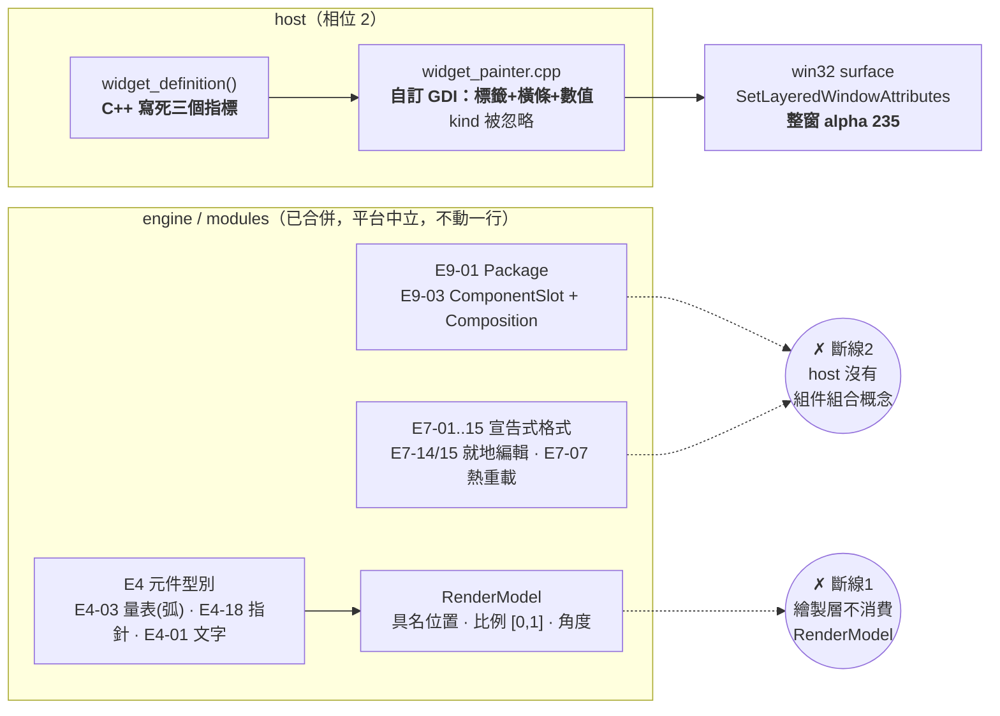
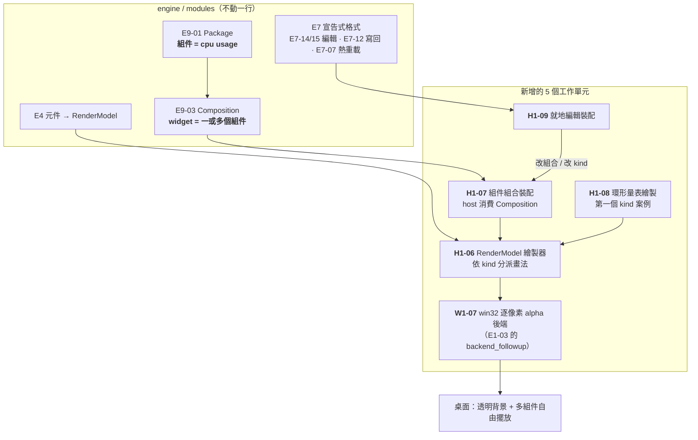
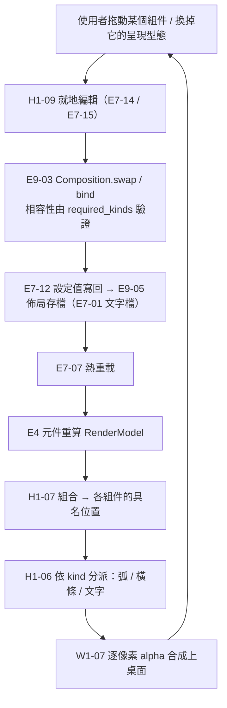

# CHG-20260810-08 — 繪製層消費 E4 元件 + 組件組合 + 就地編輯（新增 5 個工作單元）

- Date: 2026-08-10 (UTC+0) | Branch: chore/chg-20260810-08 | **Risk: medium** | Implemented by: 待派
- Skill: ai-sdlc-autopilot
- Template: 標準
- Autonomy: **medium → confirm 停點**；本檔即停點材料
- Unit: 無（本 CHG 的產出是**新增工作單元到 `units.json`**，依 AGENTS.md §3）

> **狀態：等待使用者在 confirm 停點確認設計圖與單元切分。未實作、未改 `units.json`。**

## Motivation

使用者要求：widget 要能換造型（參考 Rainmeter *simplicity circles*），
並可在程式中直接調整組件的位置與型態。使用者並澄清了組合模型：

> **每項都是獨立組件，`cpu usage rate` 就是單一組件；多個或單一組件可以組成一個 widget。**

參考畫面的具體樣貌：4×4 共 16 個獨立組件疊在桌布上、**沒有面板底**，
每個組件 = 右對齊主文字（`Core 1: 19%`）+ 下方次要文字（`52° C`）+ 右側**環形弧線**
（細線圓弧依比例填，不是指針）。

### 查證結果：需要的東西引擎裡全部都有，缺口全在 host

| 需要 | 引擎現況（皆已合併） | host 現況 |
|---|---|---|
| **組件組合模型** | **E9-03 `ComponentSlot` + `Composition`**（`add_slot`/`bind`/`swap`/`compatible_candidates`/`validate`） | 沒接 |
| 組件本身 | E9-01 統一套件格式（`Package`） | 沒接 |
| 環形弧線 | **E4-03 `GaugeElement` 值→角度/弧，另有 `set_arc`** | 畫不出弧 |
| 指針型 | E4-18 徑向線 / 指針 | 沒接 |
| 文字排版 | E4-01 | 自己 `DrawText` |
| 設定檔驅動 | E7-01 ~ E7-15 全套 | `widget_definition()` 用 C++ **寫死** |
| 就地編輯 / 拖放 / 佈局存檔 | E7-14、E7-15、E9-05、E7-12、E7-07 | 沒接 |
| **逐像素 alpha** | **E1-03**（能力鍵 `surface.per_pixel_alpha`、`AlphaMode{Opaque,PerPixel}`、null 後端） | win32 後端未補 |

使用者的心智模型與 **E9-03 一對一對應**：組件 = 綁進插槽的 `Package`，widget = `Composition`。
這不需要發明新概念。

### 採 Rainmeter 的**概念模型**，不採其格式（使用者裁定）

使用者裁定「widget 邏輯比照 Rainmeter」，並明確界定為概念模型：
**measure / meter 分離、meter 以 X/Y 相對 skin 定位、skin = 一個視窗、宣告式設定、
公式與動態變數**。

**格式相容不在此列**——Guideline §2 明確排除「相容既有格式：Rainmeter INI / skin」。
採概念模型 ≠ 吃現成 skin 檔。

概念對照（左邊 Rainmeter，右邊本 repo **已合併**的單元）：

| Rainmeter | 本 repo | 狀態 |
|---|---|---|
| `[MeasureXxx]` 資料源 | **E2-01 統一指標介面**（+ E2 的 25 個提供者） | 已合併 |
| `[MeterXxx]` 視覺 | **E4 元件型別**（30 個） | 已合併 |
| meter 的 `X` / `Y`（相對 skin，左上為原點） | **H1-07**（本 CHG 新增） | 待做 |
| skin = 一個視窗 | **E9-03 `Composition`** + win32 surface | 已合併 / 待接 |
| `skin.ini` 宣告式設定 | **E7-01**（帶 `format_version`） | 已合併 |
| `[Variables]` | **E7-02 變數系統 / E7-03 段落變數** | 已合併 |
| `DynamicVariables` | **E7-04 動態變數與執行期重算** | 已合併 |
| 公式 `(#VAR#*2)` | **E7-05 公式運算引擎** | 已合併 |
| `Group` / 批次操作 | **E7-11 群組與批次操作** | 已合併 |
| Bang / `LeftMouseUpAction` | **E6-01 命令匯流排** + E5-01 滑鼠事件 + E3 致動器 | 已合併 |
| `Container` / 遮罩 | **E4-23 容器裁切與遮罩** | 已合併 |
| 更新率分級 | **E2-02 採集頻率分級與除頻** | 已合併 |
| 主題 / 配色 | **E9-04 主題切換 / E9-09 動態配色** | 已合併 |

**沒有任何一個 Rainmeter 核心概念在本 repo 找不到家。** 這不是巧合——
E2/E4/E6/E7/E9 這五個擴充點當初就是照這個形狀設計的。

### 媒體播放控制：同樣不需要新需求

使用者另提「能控制媒體播放器」。查證：**已在帳本裡**。

| 單元 | 層 | 狀態 |
|---|---|---|
| `E2-13` 媒體播放中繼資料 | module | 已合併，`backend_followup: true`（待補 win32） |
| `E3-03` 媒體播放控制 | module | 已合併，`backend_followup: true`（待補 win32） |
| `E2-15` 音訊峰值與頻譜 | module | 已合併，`backend_followup: true` |
| `C2-07` **媒體控制** | artifact | 已合併，平台中立 |

形狀與今天看到的每一件事相同：模型有、win32 後端沒有、host 沒接。
**這三個後端不屬於本 CHG**（本 CHG 是繪製與組合層），應另開 CHG 走
`PHASE-PLAN.md` 的「對每個 `backend_followup: true` 開後續 CHG」流程。

> **一個對規劃很重要的數字**：`backend_followup: true` 的單元**共 63 個**。
> 相位 2 的本質不是「加功能」，是把 63 個真實後端填進去。媒體控制只是其中三個。

`C2-07` 另有一個設計價值：它是 H1-07 組合模型的**第二個測試案例**——
媒體控制 widget 與系統監控 widget 若能共用同一個組件，
就證明組件真的是獨立的組合單位，而不是某個 widget 裡的一列。

### 最關鍵的一條：繪製層繞過了擴充點

E4 的每個元件只產出 `RenderModel`（渲染描述）——「相位 1 不做真實繪製」是刻意的，
真實繪製是繪製層的責任。而 `host/paint/widget_painter.cpp` **完全沒有消費任何
E4 `RenderModel`**：它自己畫「標籤 + 一條橫向 track + 數值」，連 `kind` 都忽略
（`gauge` / `bar` / `progress` 三種寫法畫出來是同一條橫條）。

這不只是缺功能。`docs/ai-guideline.md` §1 寫本 repo 的產品是**平台**，
驗收條件是「能不能在**不修改平台任何一行**的前提下，讓外部加上一個 CPU 掛件」。
host 繞過 E4 擴充點自己畫，等於那個承諾在 host 這一層是空的——
**外部就算寫了新元件，也沒有任何東西會去畫它。**

### 透明背景是「相位 2 本來就欠的後端」，不是新需求

`E1-03 逐像素 alpha surface`：`platform` / `medium` / **`backend_followup: true`** /
`semantic-divergence`。相位 1 定了介面 + null 後端 + 能力鍵，
依 `PHASE-PLAN.md`「相位 2 對每個 `backend_followup: true` 的單元開後續 CHG」，
win32 後端本來就在待辦上。

現行 `src/kernel/backend/win32/win32_backend.cpp:142` 是
`SetLayeredWindowAttributes(hwnd, 0, 235, LWA_ALPHA)`——**整窗均勻半透明**。
逐像素 alpha 要走 `UpdateLayeredWindow` + 32-bit premultiplied ARGB，
兩者**在同一視窗上互斥**，是換一條呈現路徑，不是加旗標。

## Design diagrams

### 現況：兩條斷線



### 目標：host 成為既有擴充點的消費者



### 這次變更的流程（一次編輯的完整路徑）



> **順帶結果**：就地編輯做完，「手寫設定檔」免費得到——
> E9-05 存出來的就是 E7-01 文字檔，手改一樣吃得下，
> 不需要為「讀檔」單獨開一個單元。

## Impact

### 提議新增的 5 個工作單元

| 單元 | 層 | 風險 | 內容 | 相依 |
|---|---|---|---|---|
| **W1-07** | platform | **medium** | win32 逐像素 alpha 後端（`UpdateLayeredWindow`）——**E1-03 的 `backend_followup`** | E1-03、W1-01 |
| **H1-06** | artifact | **medium** | 繪製層改為消費 E4 `RenderModel`，依 kind 分派畫法 | E4-03、E4-18、E4-01 |
| **H1-07** | artifact | **medium** | 組件組合裝配：host 消費 E9-03 `Composition`，widget = 一或多個組件；**組件位置以 widget 內相對 pixel 表達**（使用者裁定） | E9-01、E9-03、H1-06 |
| **H1-08** | artifact | low | 環形弧線繪製（消費 E4-03 `GaugeElement` 的弧輸出） | H1-06 |
| **H1-09** | artifact | **medium** | 就地編輯裝配：接 E7-14 / E7-15 / E9-05 / E7-12 / E7-07 | H1-06、H1-07 |
| **H1-10** | artifact | low | widget 尺寸調整：`WM_NCHITTEST` 回 `HTBOTTOMRIGHT` 等進入系統縮放迴圈；**基準點固定左上角**；尺寸隨 E9-05 持久化 | W1-03、H1-07、H1-09 |

風險分級依 `docs/ai-guideline.md` §6：
- **W1-07**：平台耦合的 kernel 原語（alpha surface），且是能力閘控項
  （`surface.per_pixel_alpha` 必須有 `has()` 保護與降級路徑）——兩條都命中 medium。
- **H1-06**：承重最高，其餘三個 host 單元全部相依它；介面設計錯誤的擴散成本高。
- **H1-07**：定義「組件 / widget」在 host 的邊界，錯了會影響往後所有 skin。
- **H1-09**：使用者可直接改動持久化狀態，錯了會把使用者的佈局弄壞。

### 不含（避免越界）

- **不改 `engine/` 與 `modules/` 任何一行。** E4 / E7 / E9 都已合併且可用，
  這次是「終於有人去消費它們」，不是改它們。
  過程中若發現上游介面不足 → **停下回報，另開 CHG**，不得順手改上游。
- **不做 Rainmeter INI 相容**——Guideline §2 明確排除。設定格式沿用 E7-01（使用者已裁定）。
- 不做多螢幕（§0-C 既有技術債）。
- 不動 `assets/` 的 skin 內容包（roadmap WS4 的範圍，另議）。

### 定位方式：widget 內相對 pixel（使用者裁定）—— 以及它的邊界

組件位置**不用網格對齊，用 widget 內的相對 pixel**。

**這與 NFR-02 不衝突，但條件必須寫死**：Q1 決策禁的是「**kernel** 出現絕對座標」，
E4 `RenderModel` 明訂「無絕對座標 / 像素尺寸——位置具名、尺寸以比例 [0,1]」。
widget 內的相對 pixel **不是絕對座標**，放在 artifact 層合法。

但它**不得往下滲**：

```
使用者 / 設定檔  ── 相對 pixel ──▶  H1-07（唯一知道像素的地方）
                                      │ 轉成具名位置 + 比例 [0,1]
                                      ▼
                            E4 RenderModel ── 無像素 ──▶ kernel
```

**H1-07 是整個系統裡唯一知道「像素」的一層。** 一旦像素往上游滲進 E4 或 kernel，
相位 3 換 cocoa 時就會炸，而 `backend_guard` 擋不到這種洩漏（它擋的是平台命名目錄，
不是型別語意）。故 H1-07 的驗收必須包含一條**反向斷言**：
E4 / kernel 的介面上不得出現任何像素型別。

### widget 尺寸可調，基準點固定左上角（使用者裁定）

與「相對 pixel」搭配的語意很一致：**縮放 widget 不縮放內容**。
組件維持各自距左上角的像素偏移，widget 變大 = 右下多出空間，變小 = 裁掉。

**機制沿用既有路徑，不新增**：W1-03 的拖曳是 `WM_NCHITTEST` 回 `HTCAPTION`
讓系統進入移動迴圈；同一個 hook 回 `HTBOTTOMRIGHT` / `HTRIGHT` / `HTBOTTOM`
就進入系統的**縮放**迴圈。逐像素 alpha 視窗沒有標準非工作區邊框，
這是唯一乾淨的做法，而且 `CHG-20260810-07` 剛實測過那條路徑是通的
（`locked=false → HTCAPTION(2)`）。

**與「鎖定位置」的關係要定義**：目前 `locked=true` 讓 `WM_NCHITTEST` 回 `HTCLIENT`
（不可拖）。鎖定時應該也不可縮放（一個「鎖定」卻還能被拉變形的 widget 很怪），
本 CHG 採此語意；若使用者要拆成兩個開關，H1-10 的範圍要改。

### 兩個影響格式的決定（使用者已裁定 2026-08-10）

**Q-A 高 DPI 語意 → 邏輯像素（隨 DPI 縮放）。**
150% 縮放時「偏移 100px」畫成 150 裝置像素，視覺大小不變；換螢幕 / 換縮放比例時
佈局看起來一致。**寫進 `format_version`**，日後要改得走 E7-08 設定遷移，不得默默改語意。

> 代價要記下來：邏輯像素在非整數縮放（125% / 150%）下，細線圓弧會落在半像素上而模糊。
> H1-08 的繪製要自己處理（對齊到裝置像素格 或 反鋸齒，見 E4-24），
> 不能假設「邏輯像素 = 乾淨的線」。

**Q-B 縮小到蓋不住組件 → 允許裁切 + 提供「縮回內容大小」的動作。**
使用者想怎麼拉就怎麼拉，但永遠有一個動作能把看不見的組件救回來。
不採「擋住縮小」是因為拉到邊界時會突然拉不動卻不說原因，那看起來像程式壞了。

### 代使用者決定（供覆核）

- **切 5 個單元而非 1 個**：W1-07 是 platform 層，相位閘門與 host 層規則不同，
  混在一起 `backend_guard` 難判；H1-06 是承重點，單獨可審、可獨立驗收。
- **H1-08 環形量表獨立成單元**：它是「第一個證明 kind 分派真的有效」的具體案例。
  併進 H1-06 的話，H1-06 會同時是機制與案例，驗收時分不清哪個壞了。
- **建議順序 W1-07 → H1-06 → H1-07 → H1-08 → H1-09**：透明背景先做，
  否則後面每一次視覺驗收都要在「有面板底」的狀態下看，與目標畫面對不上。

## Status

Paused — 設計已完成並經使用者逐項裁定（組合模型、定位方式、DPI 語意、縮小行為、
尺寸基準點），**等待 confirm 停點的 go / no-go 才開始實作**。

> 用 `Paused` 而非 `Proposed` 是刻意的：`CHG-20260810-03` 的 G7 閘門會擋下
> Status 為 `Proposed` 的 CHG（不得合併未收尾的紀錄），而 `Paused` 是它明訂的
> 合法 WIP 狀態。本檔正是那個逃生口存在的理由——一份**刻意擱置、等人決定**的
> 設計紀錄應該進得了 main，否則它只會留在某個人的機器上。

## Verification

待確認後補。驗收方式先行約定（避免事後遷就結果）：

1. **平台承諾的驗證**（H1-06 存在的理由，也是 Guideline §1 的驗收條件）：
   外部新增一個元件型別，**不改 `src/` 與 `engine/` 任何一行**，widget 能畫出它。
2. **組合模型的驗證**（H1-07）：同一個組件（如 `cpu usage`）能同時出現在兩個 widget，
   且各自的呈現型態可不同——證明組件真的是獨立的組合單位，不是佈局裡的一列。
   **第二個案例用 `C2-07` 媒體控制**：系統監控 widget 與媒體控制 widget 共用組件，
   跨 widget 的重用比同一個 widget 內的重複更能證明組合模型成立。
3. **視覺對照**：多組件自由擺放 + 環形弧線 + 透明背景，與參考畫面逐項比對（實機截圖）。
4. **就地編輯**（H1-09）：拖動組件 → 存檔 → 重啟 → 位置還原；
   換 kind → 熱重載 → 造型改變。
5. **能力降級**（W1-07）：`surface.per_pixel_alpha` 不可用時要有明確降級路徑
   （退回整窗 alpha），不得靜默失敗——NFR-03。
6. **尺寸調整**（H1-10）：`WM_NCHITTEST` 在四邊 / 四角回對應的 `HT*` 值（確定性探測，
   同 `CHG-20260810-07` 的做法）；縮放後**左上角座標不變**；組件相對偏移不變；
   重啟後尺寸還原；`locked=true` 時四邊皆回 `HTCLIENT`（不可縮放）。
7. **像素不得上滲**（H1-07 的反向斷言）：E4 / kernel 的公開介面上不得出現任何
   像素型別。這條是 NFR-02 在本次變更下的具體形式，`backend_guard` 擋不到，
   必須以測試明確斷言。
6. **不得退步**：187 個 ctest 全綠；`CHG-20260810-07` 剛補做的 5 項操作驗收全部重跑。
